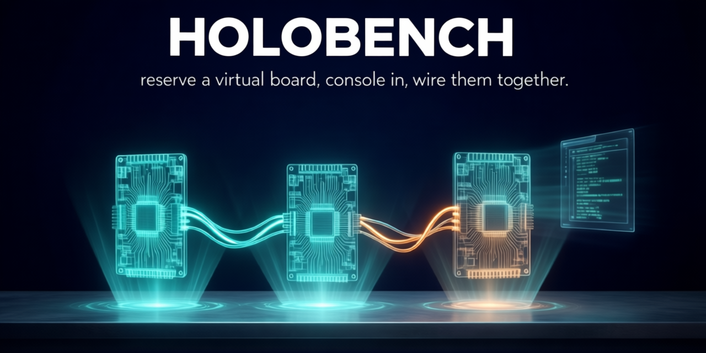

<p align="center">
  
</p>

# Holobench

**A board-farm-style web front end for QEMU machine models. A "virtual EVK."**

---


> *Reserve a board → a live serial console (left) and the board's LCD framebuffer
> (right), plus power / reset / reinstall / reservation controls. The board is a
> QEMU machine model — no silicon. (Here: i.MX 95 EVK booted to a root shell with
> an LVDS panel attached.)*

## The one-liner

You reserve a board, you get a browser tab with a live serial console, the
board's LCD framebuffer, power/reset controls, and a way to push boot files
onto it. Except there is no board. It's a QEMU machine model running on a
server, presented through the exact UX of a hardware board farm.

If you've used NXP's aiotcloud board farm (WEVK Remote Console: console window,
framebuffer panel, Power / File / System management), Holobench is that — but
the silicon is emulated, free, infinitely cloneable, and available now.

## Why this doesn't already exist

Every QEMU front end in the wild (libvirt/virt-manager, Proxmox, Cockpit,
AQEMU, the various noVNC-in-a-container projects) is **VM/datacenter-oriented**:
it abstracts a guest as a virtual machine — disk image, vCPU, RAM, lifecycle.

None of them present the **board abstraction**: "this is an i.MX 95 EVK, here is
its debug UART, here is its LCD, here is how you `tftpboot` a custom Image onto
it, here is the power button." That framing only becomes possible once
application-processor machine models with a working framebuffer, serial, and
boot flow actually exist — which is exactly what the companion emulator repos
have spent months building. Holobench is the front end that gap was waiting for.

## What it is / isn't

**Is:**
- A standalone web app that launches, supervises, and drives QEMU instances.
- A thin, machine-agnostic control plane over **stock QEMU interfaces only**.
- Board-aware via declarative **profiles**, not code. New SoC = new profile.

**Isn't:**
- Not a fork of QEMU. Not a patch to any machine model.
- Not coupled to i.MX. The i.MX 95/93/91 are the first profiles, not the design.
- Not a general datacenter VM manager. The unit of work is a *board*, not a VM.

## A look at the UI

| | |
|:--:|:--:|
| <br>**Sign in** — optional auth; an opt-in demo account is shown right on the login screen so first-timers can try it without hunting for a password. | <br>**Reserve a board** — pick a profile (i.MX 91 / 93 / 95), then *Reserve & Boot*. Reservations are time-boxed or unlimited. |
| <br>**Admin fleet view** — every running board across all users with live CPU / RAM / disk / idle, and one-click *Kill* for hogs or orphaned/idle boards (plus a Users tab). All over a mediated API; the browser never touches QMP. | <br>**Drive the board** — serial console, LCD panel (*Attach LCD*), file injection, live introspection (memory map, device tree, QMP events), gdbstub, snapshots. |

## The Prime Directive (read this before touching anything)

Holobench drives the emulators **exclusively through standard, upstreamable
QEMU mechanisms**: QMP (standard commands only), standard serial chardevs,
standard VNC/display, standard block/SD/virtfs/netdev backends, and the
standard gdbstub.

It must **never** require a custom QMP command, a custom device, a machine-model
patch, or a forked QEMU. The companion machine models are being upstreamed to
qemu.org; any coupling would both block that upstreaming and chain Holobench to
a forked binary. See `CLAUDE.md` → *Prime Directive* for the full rule and the
escalation path when something is genuinely missing from a model.

## Architecture at a glance

```
  Browser                         Holobench backend                 QEMU instance
  ┌──────────────┐   WebSocket    ┌────────────────────┐  QMP sock   ┌───────────────┐
  │ xterm.js     │◀──────────────▶│  Console bridge     │◀──────────▶│  -serial      │
  │ (UART panel) │                │                     │            │  chardev      │
  ├──────────────┤  GET .png poll ├────────────────────┤  QMP        ├───────────────┤
  │  LCD    │◀──────────────▶│  Display bridge      │◀──────────▶│  screendump   │
  │ (LCD panel)  │                │  (QMP screendump→PNG)│            │  (LCDIF/DPU)  │
  ├──────────────┤   REST/WS      ├────────────────────┤  QMP        ├───────────────┤
  │ controls     │◀──────────────▶│  Orchestrator        │◀──────────▶│  reset/stop/  │
  │ (power/files)│                │  + Session manager   │            │  cont/quit    │
  ├──────────────┤                ├────────────────────┤  9p/TFTP/   ├───────────────┤
  │ introspect   │◀──────────────▶│  File injection      │  NFS/image │  virtio-9p /  │
  │ (mem/qom/    │                │  Introspection (QMP) │◀──────────▶│  usernet /    │
  │  events)     │                │                     │            │  block        │
  └──────────────┘                └─────────┬──────────┘            └───────────────┘
                                             │ reads
                                   ┌─────────▼──────────┐
                                   │  profiles/*.yaml    │  (the board contract)
                                   └────────────────────┘
```

Full detail: `docs/ARCHITECTURE.md`. Profile schema: `docs/BOARD_PROFILES.md`.

## Status

**Working.** Reserve a board in the browser, console into it, watch its LCD,
push files onto it, inspect its internals, and attach a debugger — backed by
QEMU i.MX SoC models, through stock interfaces only.

| Phase | Capability | State |
|---|---|---|
| 0 | Launch from profile + QMP control (all 3 boards boot to a Linux prompt) | ✅ |
| 1 | Live serial console in the browser (xterm.js, bidirectional) | ✅ |
| 2 | LCD / framebuffer panel (QMP `screendump`) | ✅ |
| 3 | File injection — virtio-9p (`/mnt`) + user-net TFTP + disk image-swap | ✅ |
| 4 | Reservations — countdown + extend + **∞ no-limit option** + factory-reset reinstall | ✅ |
| 5 | Introspection — memory map, device tree, live QMP events, gdbstub, snapshots | ✅ |
| 5+ | **Virtual camera** — feed host images through the ISI into the guest's V4L2 capture (`/dev/video0`) | ✅ |
| 6 | Hardening — auth (token expiry, login throttle, WS-origin, persistent key), **per-session cgroup v2 caps** (memory/pids/cpu), asset-path lockdown, audit log, [deploy guide](docs/DEPLOY.md) | ◐ optional netns/mount-ns next |
| 6+ | **Accounts & admin** — self-service register / first-run onboarding, user management (add / remove / set-role), and an **admin fleet view**: every running board across all users with per-board CPU (per-core + % of host) / RAM / disk / idle + one-click **kill** | ✅ |
| 🧰 | **Build me a board** — build the real NXP BSP in a container (you accept the EULA; Holobench hosts/accepts nothing): pick the **image depth** (core / multimedia / full, per SoC), **pre-cache** sources for offline & restart-safe builds, SSD-backed. All 3 SoCs × 3 depths build clean. | ✅ |
| 🔗 | **Connect boards — multi-board labs (v3.0)** — wire 2+ boards over a real bus and message-pass between them: **eth / USB / UART / SPI / CAN**, all stock QEMU sockets (no host `vcan`/root/custom device), all validated byte-exact. See *[Connect two boards](#connect-two-boards-multi-board-labs)*. | ✅ |

Boards: **i.MX 91 / 93 / 95**, each in two flavors — a quick **busybox** profile
and a **full BSP distro** (`-sd`) profile that boots the real NXP `.wic`. All
capabilities work on all three.

The **virtual camera** (on the `-sd` boards) feeds uploaded raw frames through
the board's real ISI capture pipeline — the guest captures them on `/dev/video0`
in place of a sensor (drive a V4L2 → NPU vision pipeline with images of your
choosing, impossible on a fixed physical board farm). Validated byte-exact on all
three. See the **Camera** panel; each board ships its exact capture recipe.

## Quickstart

> **Before your first boot you need, per board:** (1) a **built QEMU fork** that
> registers the machine — the companion repos, see *[Related repos](#related-repos-the-boards-holobench-drives)*
> (each profile's `qemu.binary` points at it); and (2) its **boot artifacts**
> (`Image` / `dtb` / `.wic`) in `assets/<profile-id>/` — build them with *Build me
> a board* (below) or supply your own. `holobench serve` starts the UI right away;
> *Reserve & Boot* is the step that needs those two things. Running **two** boards
> (e.g. i.MX95 + i.MX93) means a QEMU fork + artifacts for **each**.

```bash
cd backend && python -m venv ../.venv && . ../.venv/bin/activate
pip install -e .
holobench serve                 # → http://127.0.0.1:8080
holobench serve --host 0.0.0.0 --port 8080   # serve the farm on your LAN
```
Open the URL → pick a board → **Reserve & Boot** → the serial console streams
live and the right-hand tabs show LCD / Memory / Devices / Events / Debug /
Snapshots / Files / Camera. Type at the guest shell; drop a file to see it at
`/mnt`.

Boot artifacts live in `assets/<profile-id>/` (kernel `Image`, `dtb`, and an
`initrd.cpio.gz` built by `tools/make-initramfs.sh` from a BSP rootfs). Each
profile's `qemu.binary` points at that board's locally-built `qemu-system-*`.

CLI (headless, no UI):
```bash
holobench profiles                    # list boards
holobench command imx91-evk           # preview the resolved QEMU command line
holobench launch imx91-evk --hold 30  # boot + prove QMP control, print console
holobench console imx95-evk-sd        # host-terminal access: PuTTY/screen serial + SSH
holobench ps | status | reset | stop  # act on a running session by id
holobench labs                        # list multi-board labs (topologies)
holobench lab launch gateway-lab      # boot a whole lab + wire the boards together
```

## Two flavors per board: quick busybox, or the real BSP distro

Each SoC ships **two** profiles:

- **`imx9x-evk`** — a tiny busybox initramfs. Boots to a shell in seconds; ideal
  for "does it come up, can I drive QMP" and fast iteration.
- **`imx9x-evk-sd`** — the **real NXP i.MX Release Distro** (the same `.wic` you'd
  flash to a real EVK): systemd, Weston, OpenSSH, the lot, on an ext4 root over
  SD (91/93) or eMMC (95). This is the "virtual EVK" in the truest sense — the
  actual board software, in a browser tab, before you have silicon. (Its depth —
  console `core`, `+graphics` multimedia, or `+ML` full — is a build-time choice;
  see *Build a board image yourself*.)

**Factory reset, built in.** The full-distro boards run on a per-session **qcow2
overlay over a read-only golden `.wic`** — so every session is isolated and
disposable, and **Reinstall** (Phase 4 / the power menu) throws the overlay away
and re-clones the golden. One click = a pristine, just-flashed board. A physical
farm needs a re-image pipeline and minutes of downtime to do that; here it's
instant and per-user.

**File injection works on both flavors.** Uploads land in a host dir shared over
virtio-9p. The busybox profiles mount it at `/mnt` from the initramfs
(`tools/init-shell`); the full-distro profiles can't run that init, so the `-sd`
profiles declare the mount on the kernel cmdline (`systemd.mount-extra=…`) and
systemd brings up `/mnt` at boot — no image surgery, all standard interfaces.
(Requires the guest kernel's 9p bits: `CONFIG_NET_9P`, `CONFIG_NET_9P_VIRTIO`,
`CONFIG_9P_FS`.)

Golden distro images live at `assets/<profile-id>/disk.wic` (the BSP `.wic`);
`tools/make-golden-disk.sh` builds a small data disk for the same overlay/reset
mechanism. Want it fully self-contained? `docker/build.sh imx95-evk-sd` bakes the
forked QEMU + M33 firmware + the distro image into one runnable container (below).

## Connect two boards: multi-board labs

A single board is the start. Holobench also wires **2+ boards together over a real
bus** and lets them message-pass — the thing a physical bench needs cables and a
second EVK to do. A **lab** is a small YAML topology (`labs/*.yaml`): board nodes +
the links between them. The coordinator launches every node and bridges each link
over a **stock QEMU socket** — no host `vcan`, no root, no custom device.

```bash
holobench labs                         # list the shipped labs
holobench lab launch gateway-lab       # boot the lab + wire the boards together
```

**Five link types, all stock QEMU, all validated byte-exact:**

| Link | How it's bridged | Guest sees | Example lab (boards) |
|---|---|---|---|
| **eth** | mcast socket = a virtual switch | `eth0` (any pair or group) | `lan-trio` (**i.MX93 ↔ i.MX95**), `eth-pair` |
| **USB** | usbredir, host ↔ CDC gadget | `/dev/ttyACM0` (USB serial) | `gateway-lab` (i.MX93 ↔ MCXN947) |
| **UART** | LPUART ↔ socket ↔ LPUART | `/dev/ttyLP1` | `uart-link-91` (i.MX91 ↔ i.MX91) |
| **SPI** | `spi-link` SSI bridge over a socket | `/dev/spidev0.0` | `spi-link-91-mcx` (i.MX91 ↔ MCXN947) |
| **CAN** | `can-host-chardev` over a socket | `can0` | `can-link-91` (i.MX91 ↔ i.MX91) |

**Want two boards to message-pass? Match the transport to what's available:**
- **Ethernet works for any pair today — including i.MX95 ↔ i.MX93** (`lan-trio`).
  Run sockets / whatever protocol you like over `eth0`. This is the go-to for
  95↔93 message-passing right now.
- **USB is a *host ↔ device* link** — one end must be a USB **gadget**. Today the
  gadget is the **MCXN947** (a CDC-ACM `/dev/ttyACM0`), so `gateway-lab` =
  **i.MX93 (host) ↔ MCXN947 (gadget)**. A **95↔93 USB** link would need a USB
  device/gadget role on a 93 or 95 model — that's an emulator-side capability
  (§7) that isn't available yet, so **for 95↔93 use the eth link above**.

Adding a board to a link, or a whole new link type, is a small profile block — no
code. Full detail (the socket contracts + how to author your own lab):
**[`docs/TOPOLOGIES.md`](docs/TOPOLOGIES.md)**.

## Build a board image yourself (the *Build me a board* wizard)

No NXP `.wic`? Build one. The wizard's 🧰 **Build me a board → Container build** runs
the real NXP i.MX Yocto build in a container on your own machine and emits `Image` +
`dtb` + `.wic` (+ the i.MX95 M33 firmware), dropped into `assets/<profile-id>/` ready
for that board's `-sd` profile to boot. You accept the NXP EULA yourself in the
terminal — Holobench hosts and accepts nothing. (Recipes per board live in
`tools/build-sources.yaml`, confirmed with each emulator session — never guessed.)

It's a real, multi-hour-from-scratch Yocto build, so the three sections below are what
make it fast and dependable — **build on an SSD**, **pick the image depth**, and **bound
the resource caps**:

## Build storage & caching (use an SSD)

> **Build on an SSD.** Yocto's `do_rootfs` assembles the rootfs with a storm of
> small writes and `fsync`s. On a spinning HDD that collapses to a crawl — measured
> here at **<2 fsync/s**, so `do_rootfs` ran for *hours* and even killing the build
> was slow. On an SSD (~2,300 fsync/s) the **same step took ~4 min**. Keep all three
> of these on the SSD: **docker's `data-root`** (the build runs in a container — its
> layers and the build `tmp` live there), **the source/sstate cache**
> (`NXP_BSP_CACHE`, default `~/.cache/holobench-nxp-bsp`), and the working tree.

**The cache is a persistent local source mirror.** The container mounts a host cache
at `/cache` holding `DL_DIR` (downloads) + `SSTATE_DIR` (sstate). It survives the
`--rm` container, so builds are incremental and reuse whatever's already there:

| Build | Wall time (measured, 32-core host) |
|---|---|
| **Cold** — empty cache, everything from source | **~4 h** |
| **Warm** — populated cache | **~8 min** |

A cold build pulls ~**80 G** of sources (≈2,000 tarballs + ~930 git mirrors + ~1,100
crates) and produces ~**22 G** of sstate; after that the cache *is* your mirror —
copy `~/.cache/holobench-nxp-bsp` to another box to seed it, or serve it over HTTP as
a `PREMIRRORS` / `SSTATE_MIRRORS` endpoint for a build fleet. For anything not local,
the build already falls back to the official **Yocto source mirror**
(`downloads.yoctoproject.org`) and the `static.crates.io` CDN — a from-scratch run
completed with **zero fetch failures**.

**Pre-cache first (recommended on a fresh machine).** Click **📥 Pre-cache sources**
on the build screen (or set `HB_FETCH_ONLY=1`) to fetch *every* source into the cache
**without building**. The real build then pulls nothing from the network — it's
**offline-capable and restart-proof**. Pre-cache is cheap and idempotent (already-fetched
sources are skipped), and `-k` means one pass surfaces every flaky upstream so you can
top up until it's clean.

```bash
HB_FETCH_ONLY=1 tools/build-nxp-bsp.sh imx95-evk-sd assets/imx95-evk-sd  # pre-cache, no build
tools/build-nxp-bsp.sh imx95-evk-sd assets/imx95-evk-sd                  # build (sources now local)
```

**Crashes & restarts resume cleanly.** Because the cache lives *outside* the
disposable container, a killed/crashed/interrupted build picks back up at **per-task
granularity**: completed tasks are restored from sstate, only an in-flight task
repeats, and no source is re-downloaded. (That recovery rebuilds the task tree from
sstate — fast on an SSD, miserable on an HDD; one more reason for the SSD.)

**No SSD but spare RAM?** Set `HB_BUILD_TMPFS=<size>` (e.g. `52g`) to mount the hot
bitbake build `tmp` on a tmpfs so `do_rootfs`/image assembly run at memory speed. The
cache stays on disk, so size it for the hot `tmp` only (~30–40 G for `imx-image-full`);
it counts against `HB_BUILD_MEM`.

## Picking the image depth (per-SoC variants)

Each container-capable SoC declares a list of NXP image **variants** in
`tools/build-sources.yaml` (`nxp_bsp.image_targets`, first = default), and the wizard's
**"Image depth"** dropdown lets you pick one:

| Variant | Contents | i.MX91 `.wic` | i.MX91 build (warm) |
|---|---|---:|---:|
| `imx-image-core` | console + base userspace | ~2.4 G | ~6 min |
| `imx-image-multimedia` | + GStreamer / Weston graphics | ~4.4 G | ~8 min |
| `imx-image-full` | + Qt + the eIQ ML stack | ~7.7 G | ~8 min |

The *same* variants build on all three SoCs — the per-SoC difference is which optional
accelerators light up (`MACHINE_FEATURES`): the 93/95 enable the **Ethos-U65 NPU**, the 91
runs the ML stack CPU-only. Headless: `HB_IMAGE_TARGET=imx-image-core tools/build-nxp-bsp.sh
imx91-evk-sd …`, or space-separate several to build them in one run (staged as
`disk-<variant>.wic`; a single variant stages as `disk.wic`).

## Bounding a container build (resource caps)

The **container build** ("🧰 Build me a board" → *Container build*) runs a full NXP
Yocto build, which is brutally parallel. Left unbounded, `bitbake` sets **both**
`BB_NUMBER_THREADS` (recipes in parallel) **and** `PARALLEL_MAKE` (`make -j` inside
each recipe) to your core count — so on a 32-core host that's up to ~1024 concurrent
compilers. That saturates every core and exhausts RAM, which can make the desktop
unresponsive or **crash the machine**; even short of a crash, the memory pressure can
push the host into swap and stall bitbake's own coordinator until the build aborts
(`Timeout waiting for the bitbake server`, typically ~80% in).

So the build is **capped by default**. Three knobs, each with a safe default:

| Knob | Env var | Default | What it bounds |
|------|---------|---------|----------------|
| CPU cores | `HB_BUILD_JOBS` | **½ of host cores** | `BB_NUMBER_THREADS` **+** a hard `docker --cpus` ceiling |
| make `-j` | `HB_MAKE_JOBS` | **4** | `PARALLEL_MAKE` — compilers per recipe (peak RAM) |
| Memory | `HB_BUILD_MEM` | **~75% of RAM** (e.g. `70g`) | a hard `docker --memory` ceiling, leaving the desktop headroom |

On top of those, the build enables bitbake **pressure regulation**
(`BB_PRESSURE_MAX_MEMORY` / `_CPU` / `_IO = 15000`), so bitbake stops launching new
tasks whenever host CPU/IO/memory pressure spikes — it backs off adaptively instead
of thrashing. The CPU and memory caps are real kernel cgroup limits, so the host can
never lose more than the budgeted cores or RAM no matter what the build spawns.

**Changing the caps.** Easiest: the build screen's **⚙ Advanced settings** panel —
enter a value to override, leave blank for the default. From a CLI/headless run, set
the env vars before launching `tools/build-nxp-bsp.sh` (or export them for the
server). Examples:

```bash
HB_BUILD_JOBS=24 HB_MAKE_JOBS=4 HB_BUILD_MEM=80g \
  tools/build-nxp-bsp.sh imx95-evk-sd assets/imx95-evk-sd   # faster, more headroom
HB_BUILD_JOBS=8 HB_MAKE_JOBS=2 HB_BUILD_MEM=24g  ...        # gentler, for a small box
```

> **Removing a cap:** set any knob to `0` (in the UI or env) to run that dimension
> **uncapped**. ⚠ An uncapped build can peg every core and exhaust memory — it may
> hang or crash the host. That's the exact failure the caps exist to prevent; only
> uncap if you know the box can take it.

### Troubleshooting

- **Host goes slow / unresponsive / crashes during a build.** The caps should prevent
  this; if it still happens, the box is too small for the budget. Lower `HB_BUILD_JOBS`
  and `HB_BUILD_MEM` (e.g. ¼ of cores, 50% of RAM). Note a heavy build *will* push the
  1-minute load average high (queued, throttled jobs) — that's normal as long as some
  CPU stays idle and RAM isn't swapping; check `top` (CPU `id`) and `free -h`
  (`available`).
- **Build aborts with `Timeout waiting for the bitbake server` around 80–90%.** Memory
  pressure starved the coordinator. Lower `HB_BUILD_MEM` and/or `HB_MAKE_JOBS` so peak
  RAM stays well within physical memory; the pressure-regulation defaults also guard
  against this. The downloads cache persists, so the re-run resumes quickly.
- **Lingering build container after a failure** (`docker ps -a` shows `hb-bsp-<board>`
  in `Dead`/`Exited`). Clear it with `docker rm -f hb-bsp-<board>`; the wrapper also
  force-removes a same-named container on the next run.

## Multi-user / auth

Holobench runs **open** (no login) until you create a user — then it enforces
per-user login and **session ownership** (you only see/control your own boards;
admins see all). Dependency-free (stdlib PBKDF2 + HMAC-signed tokens).

```bash
holobench user add alice --admin        # prompts for a password; switches auth ON
holobench user add bob                   # a regular user
holobench user list
export HOLOBENCH_SECRET=…                 # stable token-signing key across restarts
holobench serve                          # UI now shows a login screen
```
Or skip the CLI entirely — **register from the UI**: on a fresh instance the login
screen offers *"Create your admin account"* (the **first** account becomes admin —
zero-config onboarding). After that, self-signup is closed unless you set
`HOLOBENCH_ALLOW_REGISTRATION=1` (then anyone can register a regular *user*; admins
are still made via the Admin panel). For the container, `HOLOBENCH_ADMIN_USER` +
`HOLOBENCH_ADMIN_PASSWORD` seed an admin at startup.

**Admin panel** (admins only — header → *Admin*): a **Users** tab (add/remove/role)
and an **Active sessions** fleet view — every running board across all users with
per-board **CPU (per-core + % of host) / RAM / disk / idle / uptime** and one-click
**Kill** for hogs, orphaned, or long-idle boards.

| | |
|:--:|:--:|
| <br>**First-run onboarding** — a fresh instance prompts you to create the admin account (first user becomes admin); no CLI needed. | <br>**User management** — add / remove users and set roles from **Admin → Users**. |

Quotas (0 = unlimited): `HOLOBENCH_MAX_PER_USER`, `HOLOBENCH_MAX_SESSIONS`.
Users live in `data/users.yaml` (gitignored) or `$HOLOBENCH_USERS`.

**Before exposing it to a network, read [`docs/DEPLOY.md`](docs/DEPLOY.md)** — TLS
reverse-proxy, a stable signing key, login throttling, WS-origin allowlist,
per-session resource caps, and the full env-var reference + hardening checklist.

## Run as a container (the "virtual EVK")

> **Distribution & licensing.** The Holobench image bakes in **only**
> freely-redistributable bits — the OSS app and the **GPL** forked
> `qemu-system-aarch64`. It deliberately ships with **no NXP BSP artifacts**
> (kernel `Image`, board `*.dtb`, rootfs/initramfs, the i.MX95 M33 System Manager
> `m33_image.elf`, or NXP `.ko`): those are **NXP-non-redistributable**, so baking
> them into a layer you push or share would redistribute NXP's binaries. You supply
> your **own** BSP-built artifacts and **volume-mount** them at run time. (Earlier
> "fat" images that embedded the BSP were removed for exactly this reason.)

Build a small, shareable image (the board's forked QEMU + the app), then mount your
own artifacts:

```bash
docker/build.sh imx95-evk-sd                 # -> holobench:imx95-evk-sd (QEMU + app only)

docker run --rm -p 8080:8080 \
  -v /path/to/my/bsp:/artifacts \            # YOUR BSP, supplied by you
  -e HOLOBENCH_ASSET_ROOT=/artifacts \
  holobench:imx95-evk-sd
# open http://localhost:8080 → Reserve & Boot
```

Lay your mounted BSP out per board id:

```
/path/to/my/bsp/
  imx95-evk-sd/
    Image                 # your BSP kernel
    imx95-19x19-evk.dtb   # your board dtb
    disk.wic              # (or rootfs / initrd.cpio.gz — whatever the profile boots)
    m33_image_M2.elf      # i.MX95 M33 System Manager firmware (i.MX95 only)
```

`docker/build.sh <qemu-board> [advertise-boards…]` stages a clean context — the
Holobench app, the chosen board's forked `qemu-system-aarch64` (GPL), and the
selected profiles — and **refuses to build** if a restricted-looking artifact is
present in the context. Boot artifacts resolve from `$HOLOBENCH_ASSET_ROOT/<board>/`;
the i.MX95 M33 elf via the profile's `{asset_dir}` placeholder. The image uses TCG
(no `/dev/kvm` needed). Add `-e HOLOBENCH_ADMIN_USER=admin -e HOLOBENCH_ADMIN_PASSWORD=…`
to require auth + unlock the Admin panel. See [`docs/DEPLOY.md`](docs/DEPLOY.md) for
the full artifact layout, compose example, and the hardening checklist.

**Host requirements:** **x86-64 Linux** + Docker, free RAM for the board(s) you
run. (The image runs an aarch64 board under x86-64 QEMU/TCG — Apple-Silicon/ARM
hosts would nest-emulate and crawl.) First boot takes ~1–2 min (full SoC
emulation). Runs **open** by default; add `-e HOLOBENCH_ADMIN_USER=admin
-e HOLOBENCH_ADMIN_PASSWORD=secret` to require login + unlock the **Admin** panel
(optionally `-e HOLOBENCH_DEMO_LOGIN=admin:secret` for a one-click demo box).

## Repo layout

```
holobench/
  README.md  CLAUDE.md  ROADMAP.md
  docs/        ARCHITECTURE.md  BOARD_PROFILES.md  TOPOLOGIES.md (multi-board labs)
  profiles/    imx9{1,3,5}-evk.yaml (busybox initramfs)
               imx9{1,3,5}-evk-sd.yaml (full BSP distro, disk boot)
               mcxn947-*.yaml (USB/SPI gadget nodes)  virt-smoke.yaml
  labs/        *.yaml — multi-board topologies (eth/USB/UART/SPI/CAN links)
  backend/     pyproject.toml
    holobench/ profiles/ (models+loader)  session/ (command+manager+control)
               bridges/ (console tap)  api/ (FastAPI app)  cli.py
    tests/     pytest (profile + command-resolver unit tests)
  frontend/    index.html (React+htm+Tailwind+xterm.js)  vendor/ (offline deps)
  vendor/      camera/ (GPL-2.0 ISI capture helpers: source + static aarch64 bin)
  tools/       make-initramfs.sh  make-golden-disk.sh  build-capture-helpers.sh
               init-shell  init-busybox
  assets/      <profile-id>/ boot artifacts (gitignored)
  LICENSE      GPL-2.0-or-later
```

## Related repos (the boards Holobench drives)

Holobench needs a QEMU that registers these machines. The i.MX 9x models aren't
in upstream QEMU **yet** (they're being upstreamed), so today you build the
companion forks and point each profile's `qemu.binary` at the result:

| Repo | Branch | `-M` machine type |
|---|---|---|
| `kylefoxaustin/qemu-imx95` | `imx95-netc` | `imx95-19x19-evk` |
| `kylefoxaustin/qemu-imx93` | `imx93-dev`  | `imx93-11x11-evk` |
| `kylefoxaustin/qemu-imx91` | —            | `imx91-11x11-evk` |

These are the source of truth for each board's machine type, serial topology,
display device, and boot flow. Holobench consumes them via profiles. It never
modifies them. Want to see exactly what a profile resolves to before you boot?
`holobench command imx95-evk-sd` prints the full stock-QEMU command line.

### Board notes / gotchas (what an i.MX person will want to know)

These live in the profiles, not in code — but they're the non-obvious bits that
make these SoCs boot under emulation:

- **i.MX 95** — the **M33 System Manager is load-bearing**: it's loaded as a
  second CPU image (`-device loader,file=…m33_image.elf,cpu-num=6`) and serves
  SCMI; without it the A-core Linux won't come up. Boots with `cpuidle.off=1`.
  The full-distro variant roots from **eMMC** (`-device emmc` → `mmcblk0`), not SD.
- **i.MX 93** — fixed **2×A55 + 1×M33** topology, so it always launches with
  `-smp 3`. Full-distro variant roots from **SD** (`-drive if=sd` → `mmcblk0`).
- **i.MX 91** — single A55; roots from **SD**. Two user NICs.

All three use direct-kernel boot (`-kernel`/`-dtb`), TCG (no KVM), and a
standard `-serial` chardev for the A-core console.

## Renaming / rebranding

`Holobench` is just a name token — to rebrand a fork, find-replace `Holobench`
(and the lowercase `holobench` CLI/package) across the tree.

## License & credits

[GPL-2.0-or-later](LICENSE), same as QEMU. Source files carry an
`SPDX-License-Identifier: GPL-2.0-or-later` header.

> The companion emulator repos (`qemu-imx91/93/95`) are separate works under
> QEMU's own license; Holobench only *drives* them through standard interfaces
> and ships none of their code — see those repos and `LICENSE` for QEMU's
> authorship and licensing.

---

Created and maintained by **Kyle Fox** — [@kylefoxaustin](https://github.com/kylefoxaustin).
