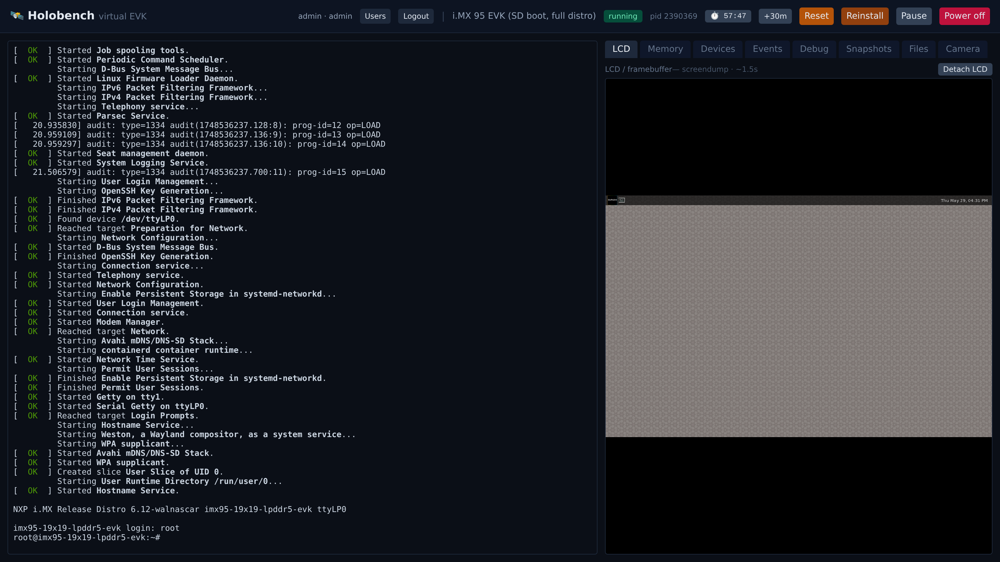
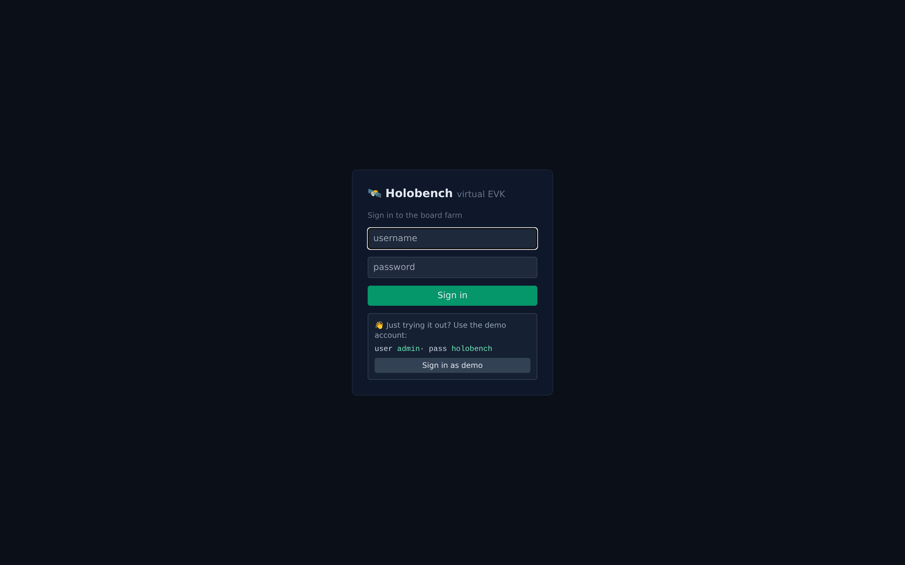
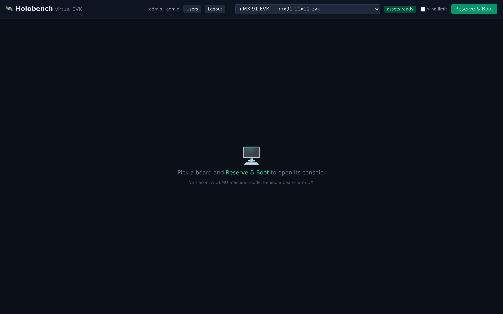
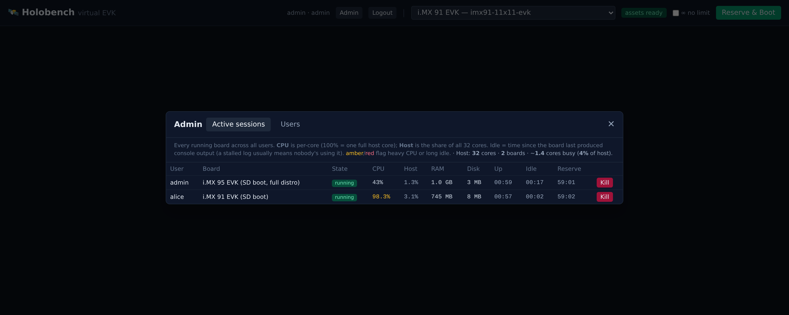
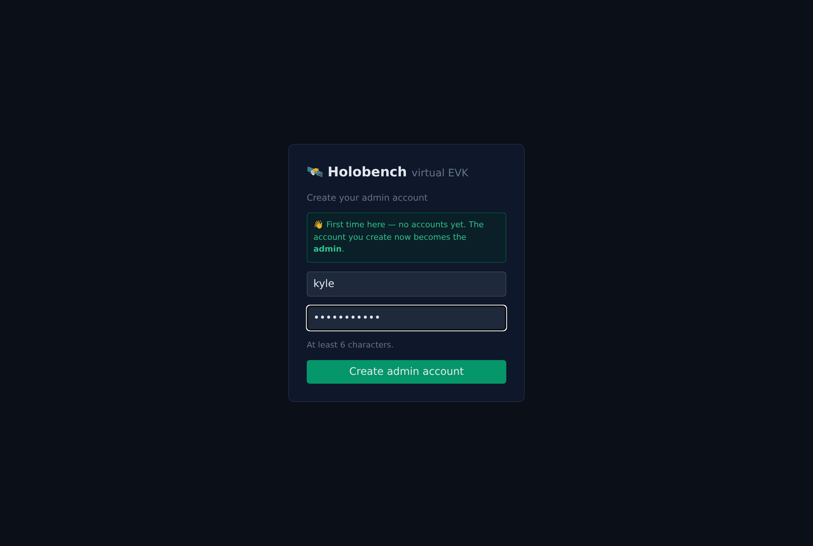
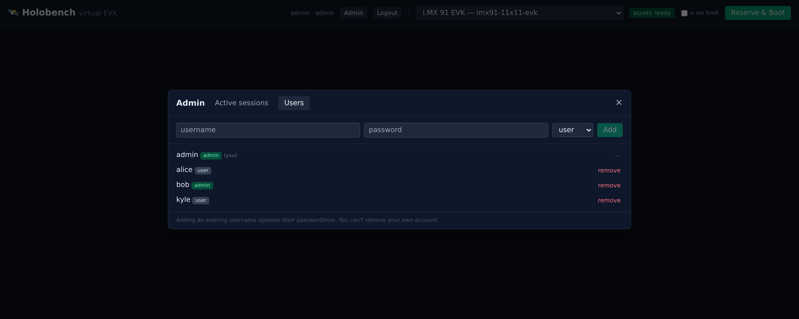

# Holobench

**A board-farm-style web front end for QEMU machine models. A "virtual EVK."**

---



> *Reserve a board → a live serial console (left) and the board's LCD framebuffer
> (right), plus power / reset / reinstall / reservation controls. The board is a
> QEMU machine model — no silicon. (Here: i.MX 95 EVK booted to a root shell with
> an LVDS panel attached.)*

## The one-liner

You reserve a board, you get a browser tab with a live serial console, the
board's LCD framebuffer, power/reset controls, and a way to push boot files
onto it. Except there is no board. It's a QEMU machine model running on a
server, presented through the exact UX of a hardware board farm.

If you've used NXP's aiotcloud board farm (WEVK Remote Console: console window,
framebuffer panel, Power / File / System management), Holobench is that — but
the silicon is emulated, free, infinitely cloneable, and available now.

## Why this doesn't already exist

Every QEMU front end in the wild (libvirt/virt-manager, Proxmox, Cockpit,
AQEMU, the various noVNC-in-a-container projects) is **VM/datacenter-oriented**:
it abstracts a guest as a virtual machine — disk image, vCPU, RAM, lifecycle.

None of them present the **board abstraction**: "this is an i.MX 95 EVK, here is
its debug UART, here is its LCD, here is how you `tftpboot` a custom Image onto
it, here is the power button." That framing only becomes possible once
application-processor machine models with a working framebuffer, serial, and
boot flow actually exist — which is exactly what the companion emulator repos
have spent months building. Holobench is the front end that gap was waiting for.

## What it is / isn't

**Is:**
- A standalone web app that launches, supervises, and drives QEMU instances.
- A thin, machine-agnostic control plane over **stock QEMU interfaces only**.
- Board-aware via declarative **profiles**, not code. New SoC = new profile.

**Isn't:**
- Not a fork of QEMU. Not a patch to any machine model.
- Not coupled to i.MX. The i.MX 95/93/91 are the first profiles, not the design.
- Not a general datacenter VM manager. The unit of work is a *board*, not a VM.

## A look at the UI

| | |
|:--:|:--:|
| <br>**Sign in** — optional auth; an opt-in demo account is shown right on the login screen so first-timers can try it without hunting for a password. | <br>**Reserve a board** — pick a profile (i.MX 91 / 93 / 95), then *Reserve & Boot*. Reservations are time-boxed or unlimited. |
| <br>**Admin fleet view** — every running board across all users with live CPU / RAM / disk / idle, and one-click *Kill* for hogs or orphaned/idle boards (plus a Users tab). All over a mediated API; the browser never touches QMP. | <br>**Drive the board** — serial console, LCD panel (*Attach LCD*), file injection, live introspection (memory map, device tree, QMP events), gdbstub, snapshots. |

## The Prime Directive (read this before touching anything)

Holobench drives the emulators **exclusively through standard, upstreamable
QEMU mechanisms**: QMP (standard commands only), standard serial chardevs,
standard VNC/display, standard block/SD/virtfs/netdev backends, and the
standard gdbstub.

It must **never** require a custom QMP command, a custom device, a machine-model
patch, or a forked QEMU. The companion machine models are being upstreamed to
qemu.org; any coupling would both block that upstreaming and chain Holobench to
a forked binary. See `CLAUDE.md` → *Prime Directive* for the full rule and the
escalation path when something is genuinely missing from a model.

## Architecture at a glance

```
  Browser                         Holobench backend                 QEMU instance
  ┌──────────────┐   WebSocket    ┌────────────────────┐  QMP sock   ┌───────────────┐
  │ xterm.js     │◀──────────────▶│  Console bridge     │◀──────────▶│  -serial      │
  │ (UART panel) │                │                     │            │  chardev      │
  ├──────────────┤  GET .png poll ├────────────────────┤  QMP        ├───────────────┤
  │  LCD    │◀──────────────▶│  Display bridge      │◀──────────▶│  screendump   │
  │ (LCD panel)  │                │  (QMP screendump→PNG)│            │  (LCDIF/DPU)  │
  ├──────────────┤   REST/WS      ├────────────────────┤  QMP        ├───────────────┤
  │ controls     │◀──────────────▶│  Orchestrator        │◀──────────▶│  reset/stop/  │
  │ (power/files)│                │  + Session manager   │            │  cont/quit    │
  ├──────────────┤                ├────────────────────┤  9p/TFTP/   ├───────────────┤
  │ introspect   │◀──────────────▶│  File injection      │  NFS/image │  virtio-9p /  │
  │ (mem/qom/    │                │  Introspection (QMP) │◀──────────▶│  usernet /    │
  │  events)     │                │                     │            │  block        │
  └──────────────┘                └─────────┬──────────┘            └───────────────┘
                                             │ reads
                                   ┌─────────▼──────────┐
                                   │  profiles/*.yaml    │  (the board contract)
                                   └────────────────────┘
```

Full detail: `docs/ARCHITECTURE.md`. Profile schema: `docs/BOARD_PROFILES.md`.

## Status

**Working.** Reserve a board in the browser, console into it, watch its LCD,
push files onto it, inspect its internals, and attach a debugger — backed by
QEMU i.MX SoC models, through stock interfaces only.

| Phase | Capability | State |
|---|---|---|
| 0 | Launch from profile + QMP control (all 3 boards boot to a Linux prompt) | ✅ |
| 1 | Live serial console in the browser (xterm.js, bidirectional) | ✅ |
| 2 | LCD / framebuffer panel (QMP `screendump`) | ✅ |
| 3 | File injection — virtio-9p (`/mnt`) + user-net TFTP + disk image-swap | ✅ |
| 4 | Reservations — countdown + extend + **∞ no-limit option** + factory-reset reinstall | ✅ |
| 5 | Introspection — memory map, device tree, live QMP events, gdbstub, snapshots | ✅ |
| 5+ | **Virtual camera** — feed host images through the ISI into the guest's V4L2 capture (`/dev/video0`) | ✅ |
| 6 | Hardening — auth (token expiry, login throttle, WS-origin, persistent key), **per-session cgroup v2 caps** (memory/pids/cpu), asset-path lockdown, audit log, [deploy guide](docs/DEPLOY.md) | ◐ optional netns/mount-ns next |
| 6+ | **Accounts & admin** — self-service register / first-run onboarding, user management (add / remove / set-role), and an **admin fleet view**: every running board across all users with per-board CPU (per-core + % of host) / RAM / disk / idle + one-click **kill** | ✅ |

Boards: **i.MX 91 / 93 / 95**, each in two flavors — a quick **busybox** profile
and a **full BSP distro** (`-sd`) profile that boots the real NXP `.wic`. All
capabilities work on all three.

The **virtual camera** (on the `-sd` boards) feeds uploaded raw frames through
the board's real ISI capture pipeline — the guest captures them on `/dev/video0`
in place of a sensor (drive a V4L2 → NPU vision pipeline with images of your
choosing, impossible on a fixed physical board farm). Validated byte-exact on all
three. See the **Camera** panel; each board ships its exact capture recipe.

## Quickstart

```bash
cd backend && python -m venv ../.venv && . ../.venv/bin/activate
pip install -e .
holobench serve                 # → http://127.0.0.1:8080
holobench serve --host 0.0.0.0 --port 8080   # serve the farm on your LAN
```
Open the URL → pick a board → **Reserve & Boot** → the serial console streams
live and the right-hand tabs show LCD / Memory / Devices / Events / Debug /
Snapshots / Files / Camera. Type at the guest shell; drop a file to see it at
`/mnt`.

Boot artifacts live in `assets/<profile-id>/` (kernel `Image`, `dtb`, and an
`initrd.cpio.gz` built by `tools/make-initramfs.sh` from a BSP rootfs). Each
profile's `qemu.binary` points at that board's locally-built `qemu-system-*`.

CLI (headless, no UI):
```bash
holobench profiles                    # list boards
holobench command imx91-evk           # preview the resolved QEMU command line
holobench launch imx91-evk --hold 30  # boot + prove QMP control, print console
holobench ps | status | reset | stop  # act on a running session by id
```

## Two flavors per board: quick busybox, or the real BSP distro

Each SoC ships **two** profiles:

- **`imx9x-evk`** — a tiny busybox initramfs. Boots to a shell in seconds; ideal
  for "does it come up, can I drive QMP" and fast iteration.
- **`imx9x-evk-sd`** — the **full NXP i.MX Release Distro** (the same `.wic` you'd
  flash to a real EVK): systemd, Weston, OpenSSH, the lot, on an ext4 root over
  SD (91/93) or eMMC (95). This is the "virtual EVK" in the truest sense — the
  actual board software, in a browser tab, before you have silicon.

**Factory reset, built in.** The full-distro boards run on a per-session **qcow2
overlay over a read-only golden `.wic`** — so every session is isolated and
disposable, and **Reinstall** (Phase 4 / the power menu) throws the overlay away
and re-clones the golden. One click = a pristine, just-flashed board. A physical
farm needs a re-image pipeline and minutes of downtime to do that; here it's
instant and per-user.

**File injection works on both flavors.** Uploads land in a host dir shared over
virtio-9p. The busybox profiles mount it at `/mnt` from the initramfs
(`tools/init-shell`); the full-distro profiles can't run that init, so the `-sd`
profiles declare the mount on the kernel cmdline (`systemd.mount-extra=…`) and
systemd brings up `/mnt` at boot — no image surgery, all standard interfaces.
(Requires the guest kernel's 9p bits: `CONFIG_NET_9P`, `CONFIG_NET_9P_VIRTIO`,
`CONFIG_9P_FS`.)

Golden distro images live at `assets/<profile-id>/disk.wic` (the BSP `.wic`);
`tools/make-golden-disk.sh` builds a small data disk for the same overlay/reset
mechanism. Want it fully self-contained? `docker/build.sh imx95-evk-sd` bakes the
forked QEMU + M33 firmware + the distro image into one runnable container (below).

## Multi-user / auth

Holobench runs **open** (no login) until you create a user — then it enforces
per-user login and **session ownership** (you only see/control your own boards;
admins see all). Dependency-free (stdlib PBKDF2 + HMAC-signed tokens).

```bash
holobench user add alice --admin        # prompts for a password; switches auth ON
holobench user add bob                   # a regular user
holobench user list
export HOLOBENCH_SECRET=…                 # stable token-signing key across restarts
holobench serve                          # UI now shows a login screen
```
Or skip the CLI entirely — **register from the UI**: on a fresh instance the login
screen offers *"Create your admin account"* (the **first** account becomes admin —
zero-config onboarding). After that, self-signup is closed unless you set
`HOLOBENCH_ALLOW_REGISTRATION=1` (then anyone can register a regular *user*; admins
are still made via the Admin panel). For the container, `HOLOBENCH_ADMIN_USER` +
`HOLOBENCH_ADMIN_PASSWORD` seed an admin at startup.

**Admin panel** (admins only — header → *Admin*): a **Users** tab (add/remove/role)
and an **Active sessions** fleet view — every running board across all users with
per-board **CPU (per-core + % of host) / RAM / disk / idle / uptime** and one-click
**Kill** for hogs, orphaned, or long-idle boards.

| | |
|:--:|:--:|
| <br>**First-run onboarding** — a fresh instance prompts you to create the admin account (first user becomes admin); no CLI needed. | <br>**User management** — add / remove users and set roles from **Admin → Users**. |

Quotas (0 = unlimited): `HOLOBENCH_MAX_PER_USER`, `HOLOBENCH_MAX_SESSIONS`.
Users live in `data/users.yaml` (gitignored) or `$HOLOBENCH_USERS`.

**Before exposing it to a network, read [`docs/DEPLOY.md`](docs/DEPLOY.md)** — TLS
reverse-proxy, a stable signing key, login throttling, WS-origin allowlist,
per-session resource caps, and the full env-var reference + hardening checklist.

## Run as a container (self-contained "virtual EVK")

The fat image bakes in the board's QEMU build + boot artifacts, so a user just
runs it and opens a browser — no setup, no host QEMU:

```bash
docker/build.sh imx91-evk            # busybox image  -> holobench:imx91-evk  (~1.7 GB)
docker run --rm -p 8080:8080 holobench:imx91-evk
# open http://localhost:8080 → Reserve & Boot

docker/build.sh imx95-evk-sd         # full i.MX95 BSP distro -> holobench:imx95-sd (~15 GB)
IMAGE=holobench:imx95-sd docker/build.sh imx95-evk-sd   # (IMAGE= overrides the tag)
```

`docker/build.sh <qemu-board> [asset-boards…]` stages a clean build context: the
Holobench app, the chosen board's forked `qemu-system-aarch64`, the real boot
artifacts (`Image`/`dtb`/`initrd.cpio.gz`/`disk.wic`), and any loader firmware
the profile references (e.g. the i.MX95 M33 System Manager elf). The image uses
TCG (no `/dev/kvm` needed). Add `-e HOLOBENCH_ADMIN_USER=admin -e HOLOBENCH_ADMIN_PASSWORD=…` to require auth + unlock the Admin panel.
`docker/compose.yaml` runs a pre-built image. Path overrides: `HOLOBENCH_QEMU`
(binary) and `HOLOBENCH_ASSET_ROOT` (assets) — set automatically inside the image.
Full-distro images are large (the `.wic` dominates); a busybox image is ~1.7 GB.

> The fat image embeds the emulator session's *forked* QEMU (the i.MX models
> aren't upstreamed yet) — fine for local use/demos; revisit publishing once the
> models land in stock QEMU. For a tiny image, stage no qemu/assets and mount
> them at run time instead.

### Try it without building — pull the prebuilt "virtual EVK"

A prebuilt full-distro **i.MX 95** image is published to GHCR (no build, no
GitHub account, no login needed):

```bash
docker pull ghcr.io/kylefoxaustin/holobench:imx95-sd        # ~15 GB, one time
docker run --rm -p 8080:8080 ghcr.io/kylefoxaustin/holobench:imx95-sd
# open http://localhost:8080 → "i.MX 95 EVK (SD boot, full distro)" → Reserve & Boot
```

Then (right-hand tabs): **Console** (log in as `root`, no password), **LCD**,
**Files** (drop a file → `/mnt`), introspection, and **Camera** — drop a raw
**640×480** frame (exactly **1843200 B**), reboot to arm, then in the console:
`insmod /mnt/ov5640.ko && /mnt/imx95-isi-capture cap /dev/video0`.

**Host requirements:** **x86-64 Linux** + Docker, ~**30 GB** free disk, ~**8 GB**
free RAM. (The image runs an aarch64 board under x86-64 QEMU/TCG — Apple-Silicon/
ARM hosts would nest-emulate and crawl.) First boot takes ~1–2 min (full SoC
emulation). Runs **open** by default (no login); add `-e HOLOBENCH_ADMIN_USER=admin
-e HOLOBENCH_ADMIN_PASSWORD=secret` to require a login and unlock the **Admin**
panel (optionally `-e HOLOBENCH_DEMO_LOGIN=admin:secret` for a one-click demo box).

> Pinned tag: `ghcr.io/kylefoxaustin/holobench:imx95-sd-v0.2.3` (bakes the i.MX95
> M33 density fix — idle board ~0.15 host core, RAM-bound, see `docs/SCALING.md` —
> self-service **register / first-run onboarding**, the **admin fleet view**
> (per-board CPU per-core + % of host / RAM / disk / idle + kill), and the
> **Attach LCD** button: reboots the board with an LVDS panel dtb so the DPU scans
> out a Weston desktop). The rolling `:imx95-sd` tag now points here too.
>
> The **i.MX 91** and **i.MX 93** boards ship too — same Attach-LCD desktop, lighter
> images: `ghcr.io/kylefoxaustin/holobench:imx91-sd` and `:imx93-sd` (~3.8 GB each).

## Repo layout

```
holobench/
  README.md  CLAUDE.md  ROADMAP.md
  docs/        ARCHITECTURE.md  BOARD_PROFILES.md
  profiles/    imx9{1,3,5}-evk.yaml (busybox initramfs)
               imx9{1,3,5}-evk-sd.yaml (full BSP distro, disk boot)  virt-smoke.yaml
  backend/     pyproject.toml
    holobench/ profiles/ (models+loader)  session/ (command+manager+control)
               bridges/ (console tap)  api/ (FastAPI app)  cli.py
    tests/     pytest (profile + command-resolver unit tests)
  frontend/    index.html (React+htm+Tailwind+xterm.js)  vendor/ (offline deps)
  vendor/      camera/ (GPL-2.0 ISI capture helpers: source + static aarch64 bin)
  tools/       make-initramfs.sh  make-golden-disk.sh  build-capture-helpers.sh
               init-shell  init-busybox
  assets/      <profile-id>/ boot artifacts (gitignored)
  LICENSE      GPL-2.0-or-later
```

## Related repos (the boards Holobench drives)

Holobench needs a QEMU that registers these machines. The i.MX 9x models aren't
in upstream QEMU **yet** (they're being upstreamed), so today you build the
companion forks and point each profile's `qemu.binary` at the result:

| Repo | Branch | `-M` machine type |
|---|---|---|
| `kylefoxaustin/qemu-imx95` | `imx95-netc` | `imx95-19x19-evk` |
| `kylefoxaustin/qemu-imx93` | `imx93-dev`  | `imx93-11x11-evk` |
| `kylefoxaustin/qemu-imx91` | —            | `imx91-11x11-evk` |

These are the source of truth for each board's machine type, serial topology,
display device, and boot flow. Holobench consumes them via profiles. It never
modifies them. Want to see exactly what a profile resolves to before you boot?
`holobench command imx95-evk-sd` prints the full stock-QEMU command line.

### Board notes / gotchas (what an i.MX person will want to know)

These live in the profiles, not in code — but they're the non-obvious bits that
make these SoCs boot under emulation:

- **i.MX 95** — the **M33 System Manager is load-bearing**: it's loaded as a
  second CPU image (`-device loader,file=…m33_image.elf,cpu-num=6`) and serves
  SCMI; without it the A-core Linux won't come up. Boots with `cpuidle.off=1`.
  The full-distro variant roots from **eMMC** (`-device emmc` → `mmcblk0`), not SD.
- **i.MX 93** — fixed **2×A55 + 1×M33** topology, so it always launches with
  `-smp 3`. Full-distro variant roots from **SD** (`-drive if=sd` → `mmcblk0`).
- **i.MX 91** — single A55; roots from **SD**. Two user NICs.

All three use direct-kernel boot (`-kernel`/`-dtb`), TCG (no KVM), and a
standard `-serial` chardev for the A-core console.

## Renaming / rebranding

`Holobench` is just a name token — to rebrand a fork, find-replace `Holobench`
(and the lowercase `holobench` CLI/package) across the tree.

## License & credits

[GPL-2.0-or-later](LICENSE), same as QEMU. Source files carry an
`SPDX-License-Identifier: GPL-2.0-or-later` header.

> The companion emulator repos (`qemu-imx91/93/95`) are separate works under
> QEMU's own license; Holobench only *drives* them through standard interfaces
> and ships none of their code — see those repos and `LICENSE` for QEMU's
> authorship and licensing.

---

Created and maintained by **Kyle Fox** — [@kylefoxaustin](https://github.com/kylefoxaustin).
